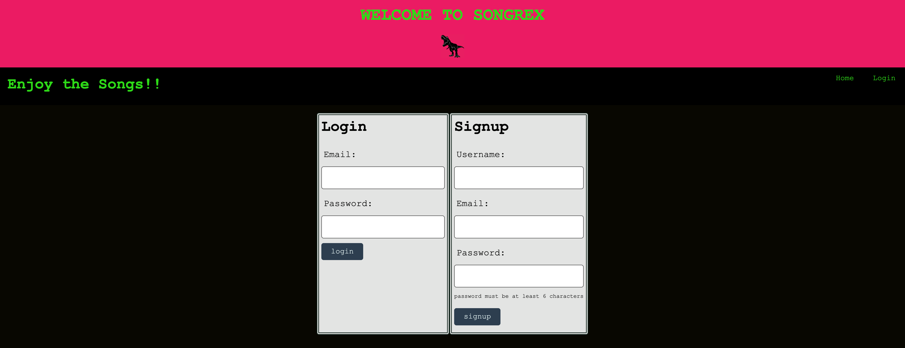
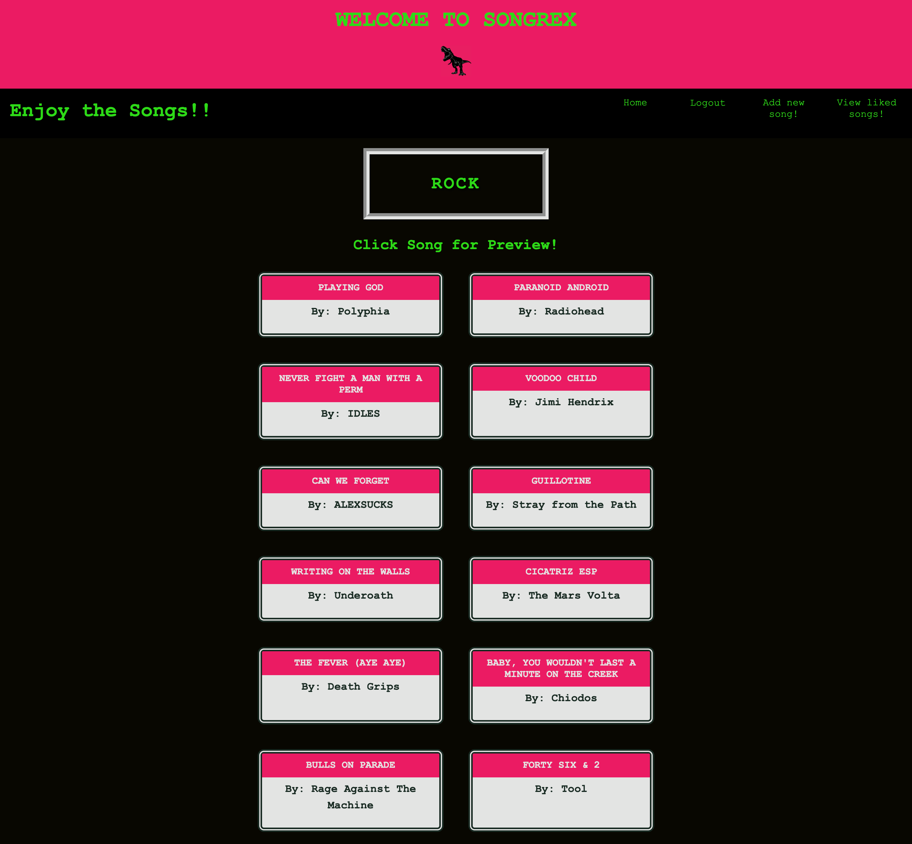
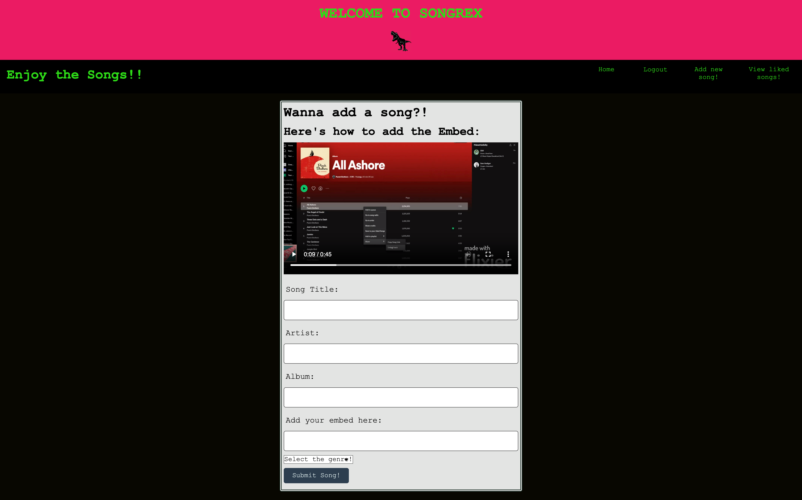
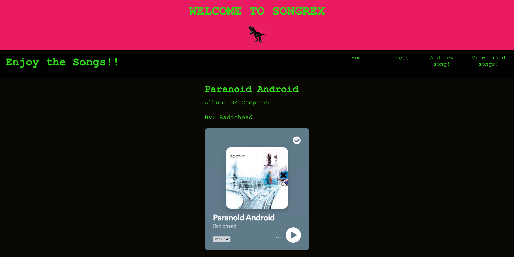
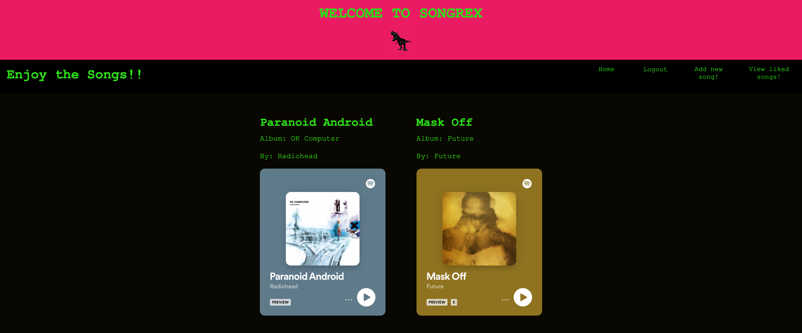

# Project-2-Studious

## Description

* SongRex is a full-stack web application that allows users to view songs by genre, artist, and album, and also post new songs by embedding their own favorite songs using Spotify's embed feature. This application was built using Node.js and Express.js to create a RESTful API, Handlebars.js as the template engine, and MySQL for the database.

## Features

* Users can view songs by genre, artist, and album.
* Users can post new songs by embedding their favorite songs using Spotify's embed feature.
* RESTful API created using Node.js and Express.js.
* Handlebars.js is used as the template engine.
* MySQL is used as the database.

## Screenshots:

<h4>Sign Up Page:</h4>

<h4>Choose your Genre:</h4>

<h4>See Songs:</h4>

<h4>Add your own spotify embed Link:</h4>

<h4>View Song:</h4>

<h4>Liked Songs:</h4>

## Collaborators

* Lohmar L'Amour
* Chris Williams
* James Eades

## [Github_Repo](https://github.com/Lohmarr/Project-2-Studious)

## [Songrex_Heroku]()